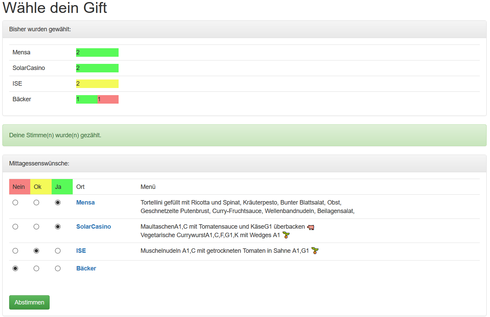

# gabin
Gabin<sup id="a1">[1](#f1)</sup> aggregates menus from different canteens presenting them as a website together with a vote form so that your department can decide where to go beforehand.




## Installation

Install all necessary python (Python > 3.6) modules in the `` requirements.txt`` (usually by running `` pip install -r requirements.txt --user``).

Set a port for the website (default: 8080) in ``config.ini.demo`` as well as the menus that shall be aggregated by modifiying the ``[restaurants]`` section. 

```
[restaurants]
mensa = Mensa, MenuStudentenwerkParser, https://www.swfr.de/essen-trinken/speiseplaene/mensa-flugplatz/
solar = SolarCasino, MenuFrauenhoferParser, https://kantine.ise.fraunhofer.de/sic
ise = ISE, MenuFrauenhoferParser, https://kantine.ise.fraunhofer.de/heidenhof
foodtrauck = Food Truck, FoodTruckParser,
               http://www.foodtrucks-deutschland.de/trucks/stadt/freiburg-liste-tour-daten-termine-aktuell
baecker = Bäcker, NullParser, None
```
Each entry is build in the form ``<id> = <displayname>, <parsertype>, <url>`` where ``id`` is just an arbitrary name, ``displayname`` is the name used for the canteen on the voting interface (and that is linked to the menu website of the canteen), ``parsertype`` is the type of the parser that shall be used to parse the canteen's website and ``url`` is the url of the website to be parsed. Currently parsers for the following websites providing menus are included:

* NullParser: just returns an empty menu (for e.g. snack bars that always have the same things and no online menu)
* MenuStudentenwerkParser: for Studentenwerk-Freiburg websites (e.g. https://www.swfr.de/essen-trinken/speiseplaene/mensa-flugplatz/ )
* MenuFrauenhoferParser: for Frauenhofer canteens (e.g. https://kantine.ise.fraunhofer.de/heidenhof/menu-heidenhof/)
* FoodTruckParser: for foodtruck-deutschland.de truck entries (e.g. http://www.foodtrucks-deutschland.de/trucks/stadt/freiburg-liste-tour-daten-termine-aktuell)
* Feel free to add your own by extending the ``MenuParser`` class in ``MenuParsers.py``

Gabin can be run by executing ``gabin.py`` as a standalone web server or as a WSGI application.


----
<b id="f1">1</b> _Gabin_ is a fictional restaurant guide featured in a series of detective stories following the cook Xavier Kieffer (Tom Hillenband, _Teufelsfrucht: Ein kulinarischer Krimi_, KiWi-Taschenbuch)
